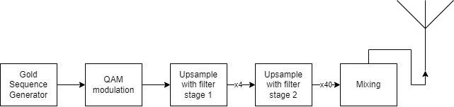
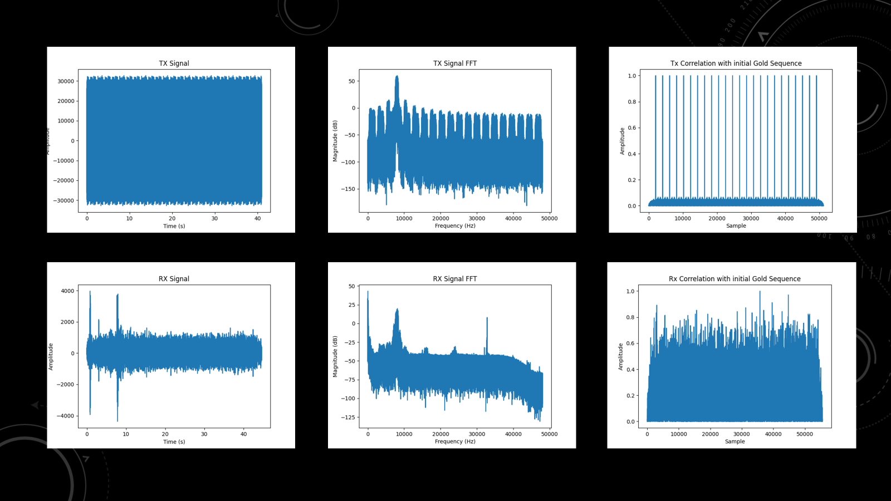
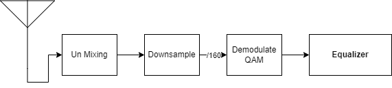
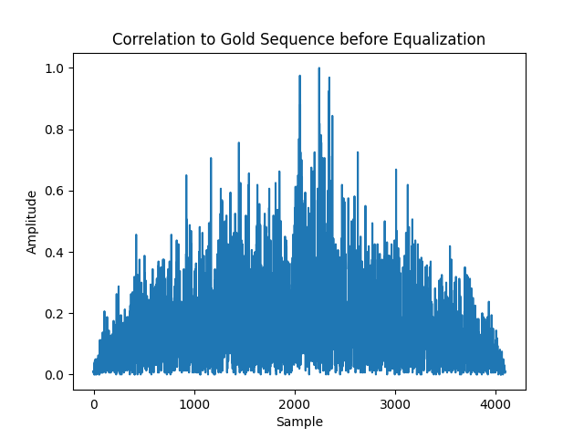
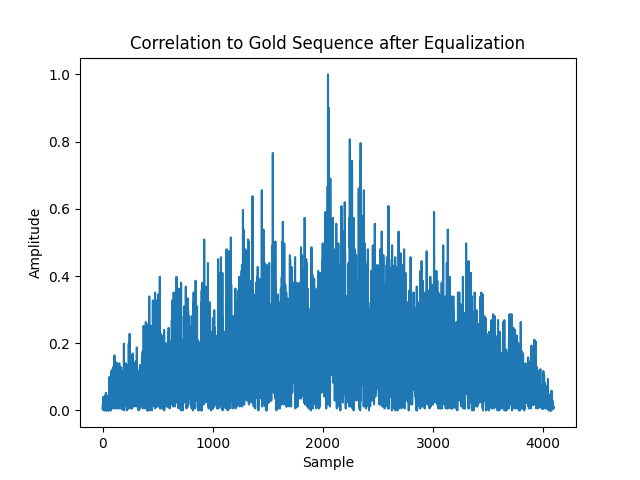

# Implementation of a Full Transmitter, Receiver, and Equalizer System in C

## Introduction

This project is an implementation of a full transmitter, receiver, and equalizer system in C. The system is designed to transmit a QAM signal over a channel and then receive and equalize the signal. The system is designed to be modular and can be easily modified to add new features or change existing ones.

## Transmitter



The transmitter is responsible for generating a QAM signal and saving it to a .wav file to be transmitted over a channel. The transmitter generates a Gold sequence to be used as a training sequence for the receiver. The transmitter then generates a QAM signal using the Gold sequence and saves it to qam.wav.

## Channel


The channel exists between a small speaker and a larger GTI hydrophone. The channel is not inside an anechoic chamber, so there is a lot of noise present. The following plots show the signal at the transmitter and receiver, the signal FFT at the transmitter and receiver, and the signal correlation to the Gold sequence at the transmitter and receiver.



## Receiver



The receiver is responsible for receiving the QAM signal from the channel and equalizing it. The receiver uses the Gold sequence to estimate the channel response and then uses this estimate to equalize the received signal. The receiver then saves the equalized signal to equalized.wav.

## Equalizer

The equalizer is responsible for equalizing the received signal. The equalizer uses the Gold sequence to estimate the channel response and then uses this estimate to equalize the received signal. The goal of this equalization is to remove the effects of the channel and recover the original QAM signal. Correlation to the Gold Sequence is used to visually show the effectiveness of the equalization because the signal is very dense.

## Initial Results





The current metric outside of correlation used to tell the effectiveness of the equalization is the error between the received signal and the transmitted signal. The error is calculated as the sum of the absolute difference between the received signal and the transmitted signal. The error is calculated in the following line of Python as follows:

```python
error = np.sum(np.abs(received_signal - transmitted_signal))
```
Result for the above plots:
```
Error between log/gold_code_ref.csv and log/equalization_results/before.csv: 2056.0
Error between log/gold_code_ref.csv and log/equalization_results/after.csv: 1989.0
```
The error is calculated to be 2056.0 before equalization and 1989.0 after equalization. The error is reduced by 67.0 after equalization.

## Future Work

- Implement a more advanced equalizer