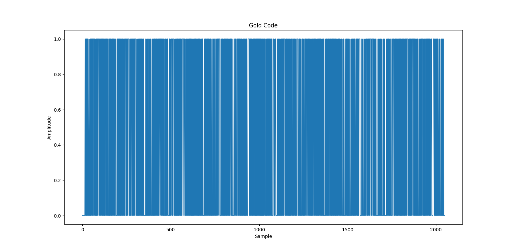

# ECED6576 Project

The following readme describes the current state of the ECED6576 project and it's next steps.

## Work Completed

### Existing code cleaned up
- DSP.h and OFDM.h have been converted to DSP.c/h and QAM.c/h.
- A function from another file in repo to generate gold codes has been added to DSP.
- Functions have been added for signal struct initialization.
- Irrelevant functions have been removed.

### New code added for logging
- Functions were written to log all custom signal structs to a file that can then be read by a python script to plot the signals.

### Python logging script has been written
- The python script reads the log file and plots the signals (complex or real).

## Plots

### Gold code

### Gold code autocorrelation

### QAM signal

## Next Steps
- Model channel and add realistic noise to the signal.
- Implement equalizer.
- Make changes for physical hardware.